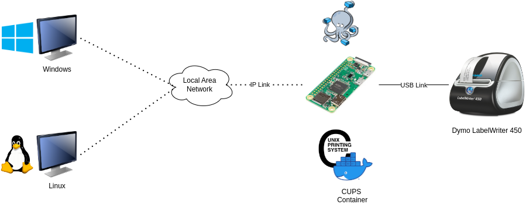

# Cups_Dymo-450

[](https://github.com/ScottGibb/Cups_Dymo-450/actions/workflows/Static%20Analysis.yaml)
[](https://github.com/ScottGibb/Cups_Dymo-450/actions/workflows/Build.yaml)
[](https://www.gnu.org/licenses/gpl-3.0)

<center>

</center>

## Summary

This repository contains a Dockerfile which runs CUPS on Raspberry Pi. This project was aimed at making the Dymo LabelWriter 450 Wireless by adding a Raspberry Pi Zero to the setup.

## Architecture

The architecture of this project is as follows:

<center>

</center>

The key parts are as follows:

- Raspberry Pi Zero W: Responsible for running CUPS and the Dymo LabelWriter 450 Drivers inside a Docker container.

- Dymo LabelWriter 450: The printer is connected to the Raspberry Pi Zero W via USB.

- PC: The PC is connected to the Local Area Network. This is where the user will be printing from.

The container is designed so that the full installation is done as soon as the container is started. As long as the USB Cable is plugged into the printer, the container should immediately attach this printer to CUPS and set it to the default printer.

## Installation

As for installing the software, the best way of installing this is to use the Dockerfile provided in this repository. This will build the image and run the container. The steps for this are as follows:

1. Clone the repository to the Raspberry Pi Zero W.
2. Run the following command to build the image and run the container, using the docker-compose.yml file, the --build will force the building of the container using the Dockerfile:

    ```bash
    docker-compose up -d --build
    ```

3. The container should now be running and the printer should be available on the network.
4. To check that the container is running, run the following command:

```bash
docker ps
```

## Continuous Integration Pipelines

Within this repository, there are two workflows:

- Static Analysis: This performs Linting on all the main filetypes of this repository such as Dockerfiles, Markdown files and Shell Scripts.

- Build: This performs the building of the Docker Image ensuring that it can be built. This is done using a Self-hosted GitHub Runner.

## Useful Links

This project was inspired by lots of other repositories and open-source projects, which are linked below:

- [Dymo LabelWriter 450](https://www.dymo.com/label-makers-printers/labelwriter-label-printers/dymo-labelwriter-450-direct-thermal-label-printer/SP_95488.html)

- [CUPS](https://ubuntu.com/server/docs/service-cups)

- [Install Dymo LabelWriter on Headless Linux](https://www.baitando.com/it/2017/12/12/install-dymo-labelwriter-on-headless-linux)

- [CUPS Dockerfile](https://github.com/olbat/dockerfiles/tree/master/cupsd)

- [Windows 10 and CUPS](https://techblog.paalijarvi.fi/2020/05/25/making-windows-10-to-print-to-a-cups-printer-over-the-network/)
