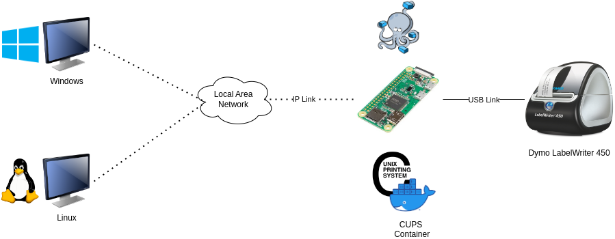

# CUPS server for a DYMO LabelWriter 450

[](https://github.com/ScottGibb/Cups-Dymo-LabelWriter450/actions/workflows/Build.yaml) [](https://github.com/ScottGibb/Cups-Dymo-LabelWriter450/actions/workflows/mega_linter.yaml) [](https://github.com/ScottGibb/Cups-Dymo-LabelWriter450/actions/workflows/release_please.yaml)

Run a network-accessible CUPS queue for a USB-connected DYMO LabelWriter 450
on a Raspberry Pi. The image uses Debian's packaged `printer-driver-dymo`
driver, automatically discovers the connected DYMO USB device, and exposes the
shared queue over IPP.


- uses the maintained Debian CUPS driver package;
- discovers the real `usb://DYMO/...` URI at runtime, with an optional override;
- starts one supervised CUPS process and waits until it is ready;
- retries safely if the USB printer is plugged in later;
- shares the queue as `dymo` over IPP;
- advertises the shared queue over Bonjour using the Pi's Avahi daemon; and
- never submits a print job by itself.

## Architecture

Network clients send print jobs over IPP to the CUPS container on the Raspberry
Pi. The Pi passes the processed jobs to the USB-connected LabelWriter 450.



## Requirements

- A Raspberry Pi connected to the LabelWriter 450 by USB.
- A container runtime that supports the Pi.
- Docker Compose v2 (`docker compose`) on the Raspberry Pi.
- The Pi's system D-Bus and Avahi services. Raspberry Pi OS normally provides
  both; a working `<pi-hostname>.local` address confirms Avahi is active.

## Supported Raspberry Pi platforms

The same Dockerfile builds for these Raspberry Pi systems:

| Raspberry Pi system                      | `uname -m` | Docker platform |
| ---------------------------------------- | ---------- | --------------- |
| Zero or Zero W                           | `armv6l`   | `linux/arm/v5`  |
| Pi 4 with 32-bit Raspberry Pi OS         | `armv7l`   | `linux/arm/v7`  |
| Pi 4 or Pi 5 with 64-bit Raspberry Pi OS | `aarch64`  | `linux/arm64`   |

Pi 4 and Pi 5 use the same 64-bit image variant. Docker selects the matching
variant automatically when the variants are published as one multi-platform
image.

## Start it on the Raspberry Pi

```sh
git clone https://github.com/ScottGibb/Cups-Dymo-LabelWriter450.git
cd Cups-Dymo-LabelWriter450
cp .env.example .env
docker compose up -d --build
docker compose logs --follow cups
```

Once the logs report `Configured printer queue: dymo`, check the queue:

```sh
docker compose exec cups lpstat -t
```

## Client setup

These steps run on the Mac, Linux PC, or Windows PC that sends jobs to the Pi;
they do not run inside the Raspberry Pi CUPS container. Start with the
[client setup overview](docs/client-setup/README.md), install the
model-specific DYMO LabelWriter 450 driver, and apply that platform's helper.

| Client  | Setup guide                                          | Helper                                |
| ------- | ---------------------------------------------------- | ------------------------------------- |
| macOS   | [macOS client setup](docs/client-setup/macos.md)     | `scripts/configure-macos-queue.sh`    |
| Linux   | [Linux client setup](docs/client-setup/linux.md)     | `scripts/configure-linux-queue.sh`    |
| Windows | [Windows client setup](docs/client-setup/windows.md) | `scripts/configure-windows-queue.ps1` |

Do not accept AirPrint, IPP Everywhere, Microsoft IPP Class Driver, Generic
PostScript, or another generic driver when you need the named DYMO stocks. The
guides explain how each operating system combines its DYMO driver with the
network queue without double-filtering jobs.

Macs and Linux desktops with DNS-SD support can discover the Bonjour queue as
`DYMO LabelWriter 450 @ <pi-hostname>`. Windows can use the address directly.

Confirm the Bonjour record from macOS with:

```sh
ippfind -T 10 _ipp._tcp _ipps._tcp --ls
```

The CUPS web interface is available at `http://<pi-hostname-or-ip>:631`. The
shared printer's standard IPP address is:

```text
ipp://<pi-hostname-or-ip>:631/printers/dymo
```

## Configuration

The defaults in `docker-compose.yml` target a standard LabelWriter 450. Copy
`.env.example` to `.env` only when you need to pin the detected USB device,
rename the queue or its Bonjour description, or select another supported DYMO
model.

Compose mounts the Pi's system D-Bus socket into the container so CUPS can ask
the existing host Avahi daemon to publish the shared queue. It does not run a
second Avahi daemon or expose a separate mDNS port from the container.

The setup script looks for the first `usb://DYMO/...` device reported by CUPS.
When several DYMO printers are connected, set `PRINTER_URI` to the exact URI
shown by:

```sh
docker compose exec cups lpinfo -v
```

## Support and diagnostics

The [documentation index](docs/README.md) separates Raspberry Pi server tasks
from client-computer setup. Use the [client setup guides](docs/client-setup/README.md)
for drivers and local queues, or the
[Raspberry Pi server troubleshooting guide](docs/troubleshooting.md) for
hardware checks, a manual test print, and recovery steps.

## Continuous integration

GitHub Actions uses MegaLinter for shell, Dockerfile, YAML, JSON, Markdown, and
workflow checks, and parses the Windows PowerShell helper for syntax errors. It
creates a separate pull request when auto-formatting is needed and validates
image builds for `linux/arm/v5`, `linux/arm/v7`, and `linux/arm64`. These cover
the original Raspberry Pi Zero W, 32-bit Pi 4, and 64-bit Pi 4 and Pi 5
systems.

Dependabot checks GitHub Actions and the Docker base image every week. Release
Please generates release pull requests from Conventional Commits.

## License

GPL-3.0-or-later.
